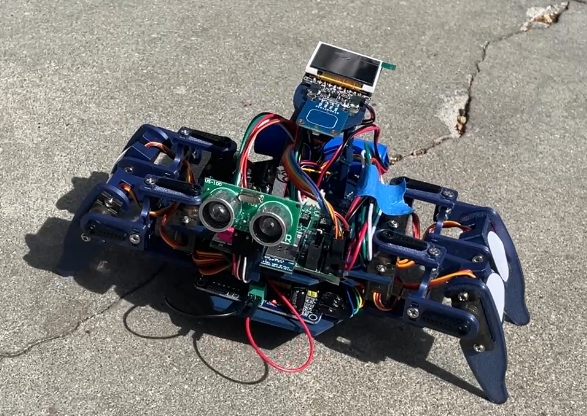
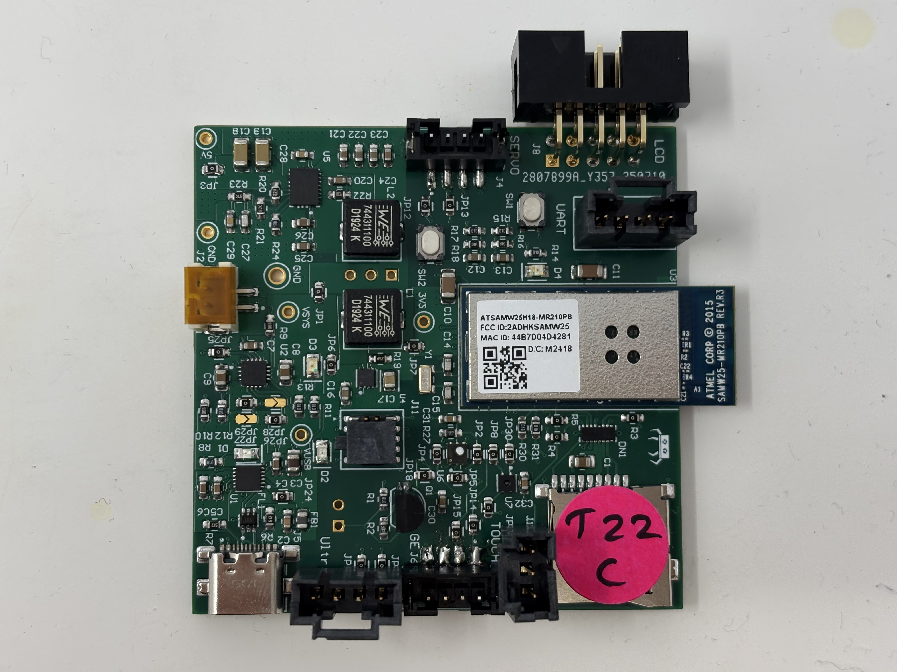
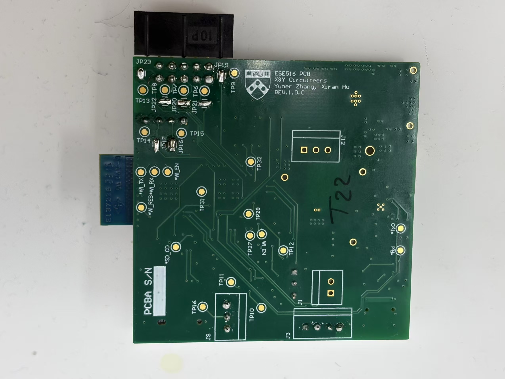
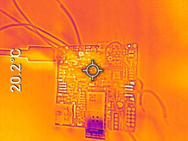
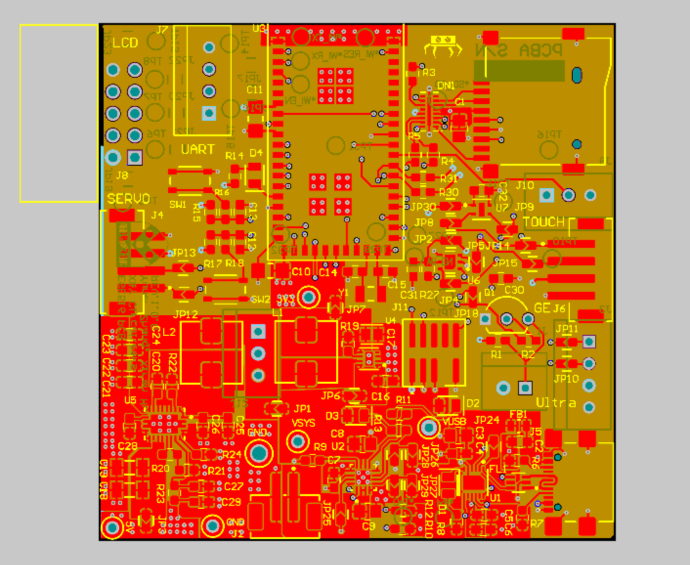
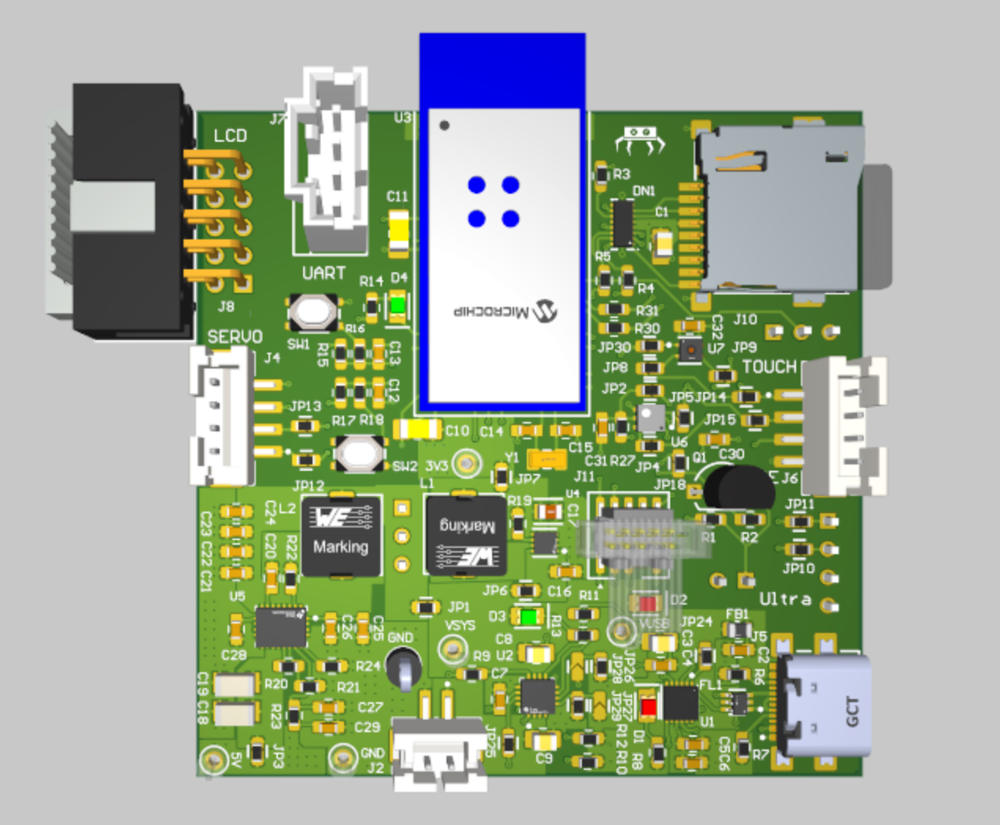
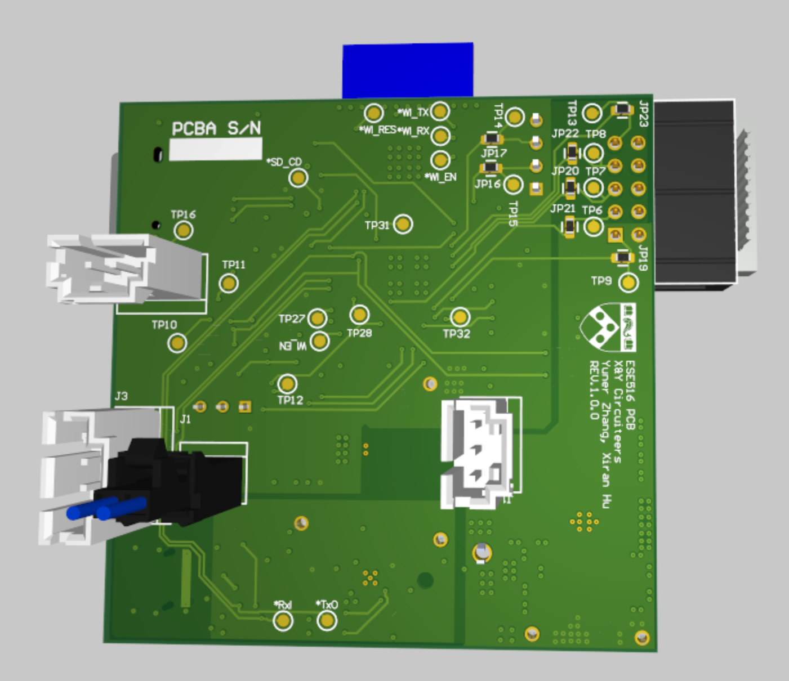
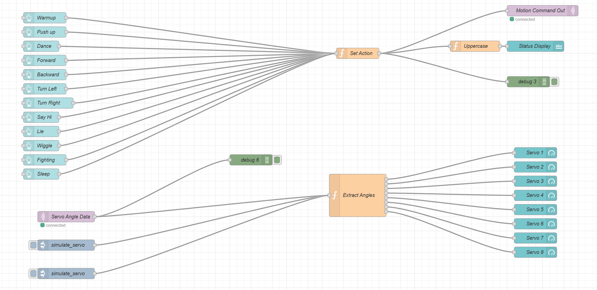
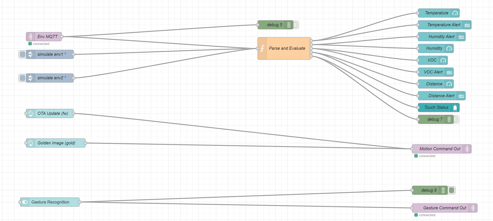

# a14g-final-submission

    * Team Number: T22
    * Team Name: X&Y Circuiteers
    * Team Members: Xiran Hu, Yuner Zhang
    * Github Repository URL: https://github.com/ese5160/a14g-final-submission-s25-t22-x-y-circuiteers
    * Description of test hardware: (development boards, sensors, actuators, laptop + OS, etc) : The laptop, SAM W25 Xplained Pro development board, SD card.

## 1. Video Presentation
Google Drive Link: [Final_Video_Presentation](https://drive.google.com/file/d/1SnDz7Wh9IL8G6lDfHzbvuNYeVGlQYDE1/view?usp=sharing).

## 2. Project Summary

### Device Description

We designed a four-legged robot named Bobi, capable of walking, striking playful poses, and monitoring its surroundings to provide timely alerts. Inspired by the longing for a pet, Bobi serves as both a lovable companion and a smart home assistant.

Our motivation stemmed from a desire for companionship and emotional comfort in everyday life. Bobi addresses this by acting as a friendly presence while helping users stay aware of their home environment.

Bobi enables real-time monitoring of **temperature**, **humidity**, **air quality**, and **obstacle distance** through an internet-connected system. Users can control Bobi via a **web-based interface**, and we support **OTAFU** (Over-The-Air Firmware Updates) for remote maintenance.

---

### Device Functionality

Bobi features two core functionalities: **movement** and **environment monitoring**.

- **Movement**:  
  A servo driver board connected to the SAMW25 microcontroller controls eight servo motors to operate Bobi’s legs. Pressing the **touch sensor** triggers a playful wiggle, while the **gesture sensor** detects hand waves to turn Bobi left or right.

- **Environment Monitoring**:  
  Bobi monitors **temperature**, **humidity**, **VOC levels (air quality)**, and **obstacle distance**. If any value exceeds the normal range, Bobi displays a warning on-screen and sounds a buzzer. For instance, if something is too close, Bobi beeps and moves backward.

- **NFC Integration**:  
  Tapping a phone on Bobi’s leg triggers a custom message display on the screen.

---

### Challenges

1. **Servo Coordination**:  
   Controlling eight servo motors simultaneously to enable smooth, lifelike movements was our first major challenge. We tested numerous angle-delay combinations to achieve natural motion.

2. **Memory Constraints**:  
   Integration revealed memory limitations when running all functions concurrently. To address this, we implemented **FreeRTOS** for efficient task scheduling and added a toggle switch to enable gesture detection only when needed, saving system memory.

---

### Prototype Learnings

Building Bobi taught us the importance of **co-planning hardware and software** from the start. Synchronizing movement control with sensor feedback was key to achieving responsive, realistic behavior.

We also discovered the value of **incremental testing**—debugging in small steps allowed us to identify and resolve issues early, ultimately improving the design.

If we were to redesign Bobi, we would:
- Choose a microcontroller with greater memory capacity.
- Strengthen the robot's frame for better stability.
- Develop a mobile app for enhanced control and user experience.

---

### Next Steps & Takeaways

For future iterations, we plan to:
- Add more gesture types for expanded interaction.
- Offload data processing to the cloud to reduce local memory usage.

Through **ESE5160**, we gained practical skills in:
- **PCB design**
- **Hardware debugging**
- **FreeRTOS task management**
- **Firmware updating**

This course gave us end-to-end experience in building a complete IoT system, blending embedded systems with real-world applications.

### Project Links
- Frontend Node_RED Link: http://52.224.120.179:1880/ui/#!/0?socketid=mmrCvhwkhdHmjPopAADz
- Backend Node_RED Link: http://52.224.120.179:1880/#flow/80e1a0e60252a46e
- PCBA on Altium 365： https://upenn-eselabs.365.altium.com/designs/A79E618E-7113-4BD9-AB95-6F9120FF25BC

## 3. Hardware & Software Requirements
This section reviews our original hardware and software requirements, outlines our testing process, and notes whether each was met.

### Hardware Requirements Specification (HRS)

#### **HRS 01 – Core Microcontroller**  
- *Met.*  
- Used SAMW25 with Wi-Fi and support for I2C, SPI, UART, and PWM. All interfaces worked as needed.

#### **HRS 02 – Ultrasonic Sensor**  
- *Met.*  
- Accurately detected obstacles in the 10–25 cm range. Triggered backward movement when too close.

#### **HRS 03 – Temperature and Humidity Sensor**  
- *Met.*  
- Compared with external meter; readings within acceptable error (±2°C, ±5%).

#### **HRS 04 – Air Quality Sensor**  
- *Met.*  
- VOC values responded correctly. Alerts triggered above 400 ppb.

#### **HRS 05 – Touch Sensor**  
- *Met.*  
- Touch triggered servo movement reliably in all test cases.

#### **HRS 06 – LCD Display**  
- *Met.*  
- Displayed real-time temperature, humidity, VOC, distance, and movement state.

#### **HRS 07 – Buzzer**  
- *Met.*  
- Activated during environmental alerts; sound was clear and consistent.

#### **HRS 08 – Servo Motors**  
- *Met.*  
- Controlled all 8 servos with stable PWM updates; motion patterns tested successfully.

#### **HRS 09 – Power System**  
- *Partially Met.*  
- Used Li-Ion battery with buck/boost circuits. Power dips occurred under heavy servo load; improvement needed.

#### **HRS 10 – Structure and Materials**  
- *Met.*  
- Used 3D-printed parts. Frame was stable, total weight < 4 kg.

---

### Software Requirements Specification (SRS)

#### **SRS 01 – Servo Motor Control**  
- *Met.*  
- PWM updated every 50 ms. Predefined motions ran smoothly.

#### **SRS 02 – Obstacle Detection and Avoidance**  
- *Met.*  
- Sampled every 1s. Avoidance triggered at <10 cm.

#### **SRS 03 – Environmental Data & Alerts**  
- *Met.*  
- Collected every 1s. Alerts worked at defined thresholds (e.g., VOC > 600 ppb).

#### **SRS 04 – Touch Response**  
- *Met.*  
- Touch caused consistent wiggle action.

#### **SRS 05 – Communication & Remote Control**  
- *Met.*  
- Synced data and responded to control commands via Wi-Fi every 1s.

## 4. Project Photos & Screenshots

### Final Assembly
- **Completed Robot**  
  

### Hardware: PCBA
- **Top View**  
  
- **Bottom View**  
  

### Thermal Imaging
- **Thermal Camera Snapshot**  
  

### Altium Board Design
- **2D Layout**  
  
- **3D View - Perspective 1**  
  
- **3D View - Perspective 2**  
  

### Software: Node-RED Interface
- **Dashboard Interface**  
  
- **Backend Flow - Part 1**  
  
- **Backend Flow - Part 2**  
  

### System Overview
- **Block Diagram**  
  

## Codebase

- **Final Embedded C Firmware Codebase**  
   [**final embedded C firmware codebases**](final embedded C firmware codebases)

- **Node-RED Dashboard Code**  
  [**final_node_red**](final_node_red)

